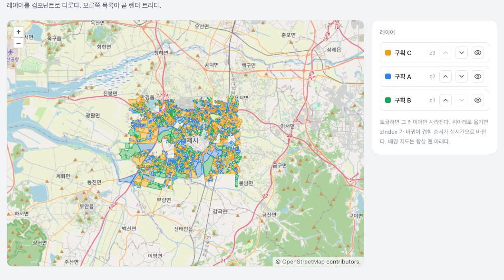

# declarative-openlayers

OpenLayers 를 선언형 React 트리로 다룬다. 레이어를 컴포넌트로 쓰고, 명령형 지도 조작은 안 보이게 감춘다.



```tsx
<MapCanvas center={[126.87, 35.8]} zoom={11}>
  <TileLayer id="osm" source={new OSM()} zIndex={0} />
  <VectorLayer id="parcels" features={loadParcels()} zIndex={2} visible={show} />
</MapCanvas>
```

## 돌려보기

```bash
pnpm install
pnpm dev
```

## 왜

OpenLayers 는 명령형이다. `map.addLayer()`, `layer.setZIndex()`, `source.clear()` 를 순서 맞춰 직접 부른다. React 는 선언형이다. "무엇이 있어야 하는가"를 그리면 나머지는 알아서 맞춰진다. 둘을 그냥 섞으면 레이어가 깜빡이거나, 중복으로 붙거나, 사라진 레이어가 지도에 남거나, 겹침 순서가 꼬인다.

이 프로젝트는 그 경계를 한 줄로 긋는다. 명령형 조작은 전부 코어에 가두고, React 는 그 위에 얇게 얹는다.

## 두 층

**코어 (`src/core`)** 는 OpenLayers 만 안다. `LayerManager` 가 키로 레이어를 등록하고, zIndex 순서를 지키고, feature 를 갈아끼운다. React 가 없어도 되므로 어려운 부분을 그냥 테스트할 수 있다.

**바인딩 (`src/bindings`)** 은 코어를 감싸는 선언형 층이다. `<MapCanvas>` 가 지도를 만들고, `<TileLayer>` · `<VectorLayer>` · `<ImageLayer>` · `<CustomLayer>` 가 각자 자기 라이프사이클만 관리한다.

- 마운트하면 등록하고, 언마운트하면 걷어낸다. 렌더 트리에 있는 동안만 지도에 있다.
- prop 이 바뀌면 그에 맞는 조작만 부른다. `visible` 이 바뀌면 가시성만, `zIndex` 가 바뀌면 순서만.
- `features` 가 바뀌면 레이어를 새로 만들지 않고 소스만 갈아끼운다. 그래서 안 깜빡인다.

레이어 컴포넌트는 화면에 아무것도 그리지 않는다. 지도에 무엇이 있어야 하는지를 적는 선언일 뿐이다.

## 타입으로 막는 것

레이어를 등록하면 종류를 타입에 담은 손잡이가 나온다.

```ts
const handle = manager.add("parcels", { kind: "vector", features });
manager.replaceFeatures(handle, next);      // 벡터 손잡이 → 통과
manager.replaceFeatures(tileHandle, next);  // 타일 손잡이 → 컴파일 에러
```

`replaceFeatures` 는 벡터에만 되는 동작이다. 타일이나 이미지 손잡이를 넘기면 실행이 아니라 컴파일에서 걸린다. 같은 규칙을 `src/core/types.test-d.ts` 가 `@ts-expect-error` 로 고정한다.

## 데모

전북 김제 농경지 필지를 세 구획으로 나눠 벡터 레이어 셋으로 올리고, 배경은 OSM 타일이다. 왼쪽 패널은 지금 마운트된 레이어를 JSX 트리 모양으로 그린다. 그 트리가 곧 지도 상태다.

- 노드를 토글하면 그 레이어만 사라진다.
- 위아래로 옮기면 zIndex 가 바뀌어 겹침 순서가 실시간으로 바뀐다.
- 배경 타일은 항상 맨 아래에 고정된다.

필지 데이터(`public/parcels.geojson`)는 전북 김제 OSM 농경지(ODbL)다. `custom` 종류를 쓰면 이런 벡터 말고 임의의 OL 레이어도 같은 방식으로 얹을 수 있다.

## 좌표계

농지 데이터는 EPSG:5179(한국 좌표계)로 들어온다. `registerKoreanCRS()` 가 proj4 정의를 OpenLayers 에 등록하고, 데이터를 읽을 때 지도 좌표계로 옮긴다. 등록이 빠지면 레이어가 엉뚱한 곳에 놓인다.

## 한계

지원하는 레이어 종류는 tile · vector · image · custom 네 가지다. 원본에 있던 vectorTile · webglTile 은 앱에 묶이는 것이라 뺐다. 필요하면 `custom` 으로 아무 OL 레이어나 얹을 수 있다.

레이어 `id` 는 처음 값으로 고정한다. 도중에 바꾸면 다른 레이어가 되므로 지원하지 않는다.

## 개발

```bash
pnpm test        # 코어는 헤드리스 OL 로, 바인딩은 React Testing Library 로
pnpm typecheck
pnpm lint
```

## License

MIT
